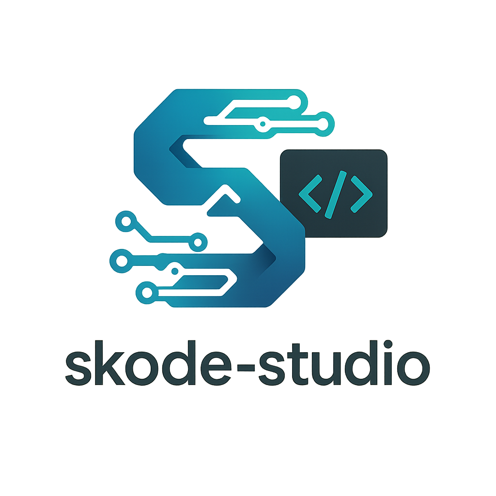

# Skcode Studio

---

## Overview

**Skcode Studio** is a modern, AI-powered IDE designed for building, testing, and managing **code agents** with ease.  
It combines the simplicity of a lightweight editor with advanced AI features, enabling developers to focus on creativity instead of boilerplate.  

With built-in agent orchestration, debugging tools, and extensible plugins, Skcode Studio empowers teams to scale from prototypes to production-ready AI-powered systems.

---
